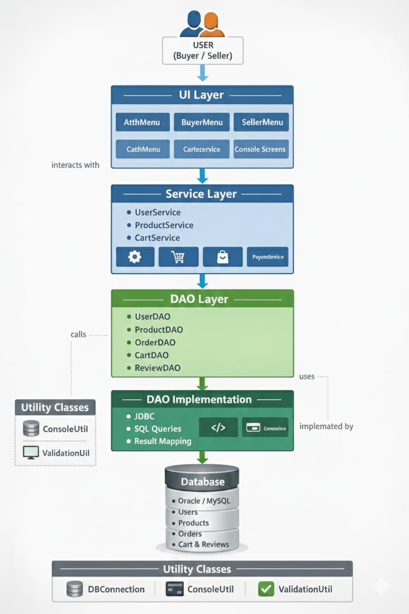
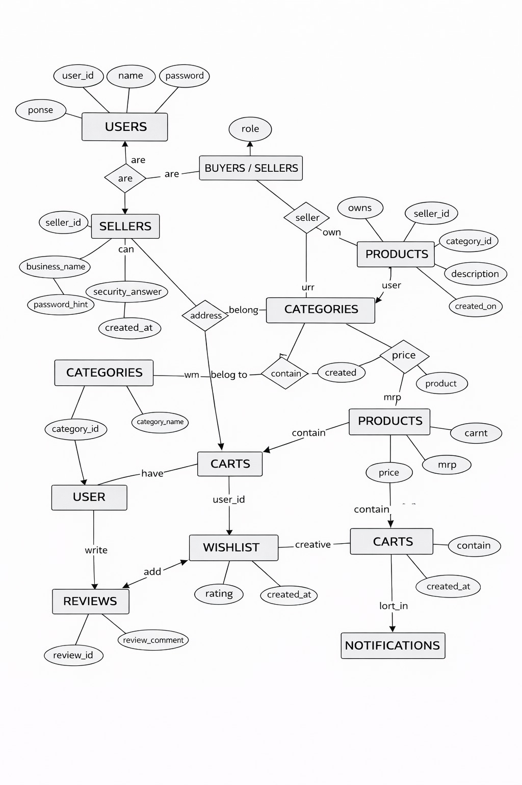

# RevShop – Console Based E-Commerce Application

## Project Overview

**RevShop** is a secure, console-based e-commerce application developed using **Java, JDBC, and MySQL**.  
The system enables interaction between **Buyers** and **Sellers** through a structured and modular architecture.

The application is designed using **Object-Oriented Programming (OOP)** principles and follows a **layered architecture** (UI, Service, DAO, Model), making it scalable for future migration into a web or microservices-based system.

---

## Problem Statement

Traditional small-scale sellers often lack a simple system to manage products, inventory, and customer orders efficiently.  
RevShop addresses this by providing a centralized platform where:

- Buyers can browse and purchase products
- Sellers can manage inventory and orders
- The system maintains secure and structured data handling

---

## Features

### Buyer Module

- User Registration and Login
- Browse available products
- Add products to cart
- Manage cart items
- Place orders
- Add product reviews
- Manage wishlist

### Seller Module

- Seller Registration and Login
- Add new products
- Update product details
- Delete products
- View customer orders
- Manage inventory stock

### Common Features

- Secure authentication system
- Forgot Password functionality
- Input validation using Regex
- Exception handling
- Structured database design

---

## Technology Stack

### Frontend (Interface)

- Java Console (Scanner-based UI)

### Backend

- Java
- JDBC

### Database

- MySQL

### Tools Used

- Eclipse / IntelliJ IDEA
- MySQL Workbench
- Git & GitHub

---

## Architecture Diagram

The application follows a layered architecture separating presentation, business logic, and database operations.

---

## Project Architecture

The project is designed using a **Layered Architecture**:

### UI Layer

- Handles user interaction through console menus
- Accepts user inputs and displays outputs

### Service Layer

- Contains business logic
- Processes user requests
- Validates data before sending to DAO

### DAO Layer

- Handles database operations using JDBC
- Executes SQL queries

### Model Layer

- Contains entity classes such as:
  - User
  - Product
  - Cart
  - Orders
  - Reviews
  - Wishlist

---

## Database Tables

Main tables used in the project:

- Users
- Products
- Cart
- Orders
- Order_Items
- Reviews
- Wishlist

---

## Entity Relationship (ER) Diagram

The ER diagram represents the relationships between users, products, orders, cart, and other entities.

---

## Validations Implemented

- Email validation using Regex
- Password strength validation
- Mobile number validation
- Empty input checks
- Exception handling for invalid operations

---

## Security Features

- Login authentication
- Password reset using security question
- Controlled access for Buyer and Seller roles
- Prevention of invalid data entry through validations

---

## Learning Outcomes

* Implemented OOP concepts (Encapsulation, Abstraction, Inheritance, Polymorphism)
* Used JDBC for database connectivity
* Designed normalized database schema
* Applied layered architecture
* Implemented validations and exception handling

---

## Author

**Adi Jahnavi**
B.Tech Computer Science (2024 Graduate)

---
